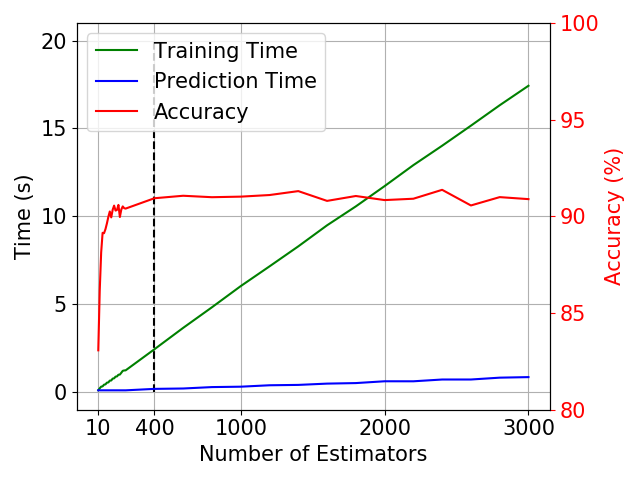
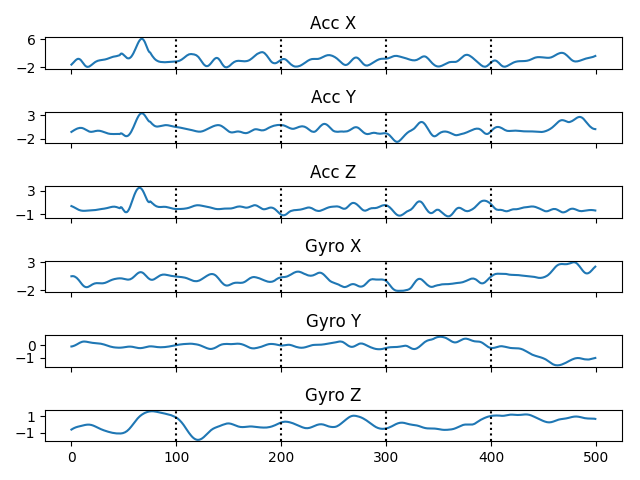

# You Walk, We Authenticate: Lightweight Seamless Authentication Based on Gait in Wearable IoT Systems

This is python code for the paper work published in IEEE Access. You can access to the paper through this [link
](https://ieeexplore.ieee.org/document/8672772)

## Prerequisities
- Language: Python
- Required Packages: numpy, pandas, matplotlib, scipy, sklearn
- To install the required package, type the following command:
1) Python 2
```
pip install numpy pandas matplotlib scipy sklearn
```
2) Python 3
```
pip3 install numpy pandas matplotlib scipy sklearn
```

## Running the code
1. Data Preprocessing: change the raw csv file names according to each volunteer's name and categorize them into activities
```
python3 data_preocessing.py
```
2. Data Filtering & Feature Extraction & Classification
```
python3 classfication.py
```
3. Data Visualization
```
python3 data_visualize.py
```
4. Visualization for Accuracy VS Number of Estimators
```
python3 accuracy_num_estimator_visualization.py
```


5. Error Case Visualization
```
python3 error_case_visualization.py
```



